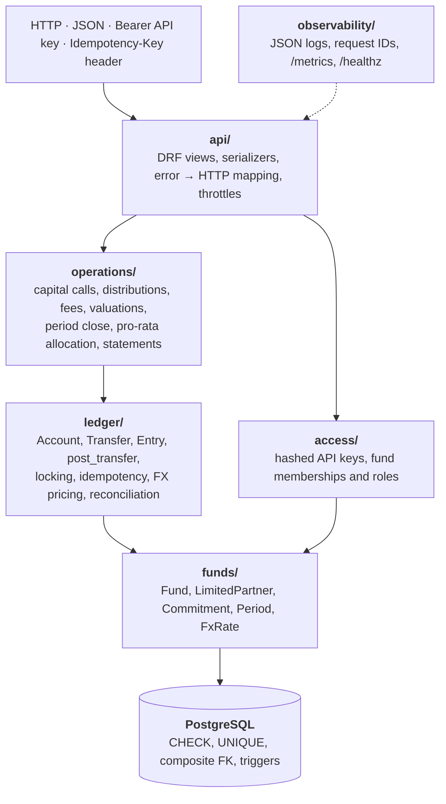

# Fund Ledger

[](https://github.com/IbraCoded/fund-ledger/actions/workflows/ci.yml)

A double-entry ledger for private-equity fund accounting, covering capital calls, distributions,
reversals, FX, fees, valuations, period close and LP capital account statements. PostgreSQL
enforces correctness itself: the database rejects unbalanced, edited or deleted entries,
so the rules hold even if the application code has a bug. Access uses hashed API keys and
fund-scoped roles, and every endpoint denies by default.

Django 5.2 · Django REST Framework · PostgreSQL 16 · Python 3.12

## What it does

Limited Partners (LPs) commit capital to a fund. The fund calls that capital, invests it,
charges fees, revalues its holdings and distributes proceeds back to the LPs. Every one of
those events is recorded as a **transfer**: a set of entries across accounts that must sum
to exactly zero. The ledger guarantees that:

- no money is lost or double-counted, and no transfer is ever silently edited,
- a balance can be asked for at any point in time ("this LP's balance on 30 June"),
- concurrent requests can't corrupt balances or overdraw an account,
- a retried request can't move money twice.

## Architecture



Imports only point downwards. The `ledger` engine knows nothing about capital calls. Its only
job is to move amounts between accounts atomically, exactly once, without ever letting the
books go out of balance. Business operations are thin clients of that engine: they work out
the amounts, then call `post_transfer`. Keeping the engine small means it can be tested
exhaustively with property-based and real multi-connection concurrency tests.

Each rule is enforced at three levels: serializers reject malformed input with a 400,
services apply business rules with clear errors, and the database has the final say.

### One capital call, end to end

```
RequestIDMiddleware        binds request_id to every log line
└─ ApiKeyAuthentication    Bearer key → SHA-256 lookup; 401 if missing, invalid, expired or revoked
└─ FundRolePermission      non-member → 404; member below OPERATOR → 403
└─ throttles               per-user budget, tighter for money-moving POSTs → 429
└─ CapitalCallsView        requires Idempotency-Key; money parsed as Decimal, never float
   └─ with_deadlock_retry  retries on Postgres 40P01 / 40001
      └─ run_idempotent    SAVEPOINT
         └─ create_capital_call
            ├─ SELECT fund FOR UPDATE                  serialises call numbering
            ├─ allocate()  pro-rata, largest remainder
            └─ post_transfer
               ├─ SELECT accounts FOR UPDATE ORDER BY id   deadlock-free lock order
               ├─ price legs (FX), check balanced, check funds
               ├─ INSERT transfer + entries   ── trigger: is the period OPEN?
               └─ SET CONSTRAINTS IMMEDIATE   ── deferred trigger: do entries sum to 0?
         ├─ success → RELEASE SAVEPOINT → 201
         └─ duplicate key → ROLLBACK TO SAVEPOINT, compare request fingerprint → 200 or 422
```

## Invariants and how they're enforced

| Invariant | Enforced by | Proven by |
|---|---|---|
| Every transfer balances | Deferred constraint trigger, checked at commit | [`test_unbalanced_transfer_is_rejected_at_commit`](tests/ledger/test_db_invariants.py#L38) |
| Entries and transfers are append-only | Database triggers reject UPDATE and DELETE | [`test_entries_cannot_be_updated`](tests/ledger/test_db_invariants.py#L63) |
| An entry's currency is its account's currency | Composite foreign key | [`test_entry_currency_must_match_account`](tests/ledger/test_db_invariants.py#L78) |
| Balances are derived, never stored | No balance column; point-in-time queries over entries | [`test_point_in_time_balance`](tests/ledger/test_post_transfer.py#L107) |
| Money is exact | `NUMERIC(20,4)`; JSON numbers parsed as `Decimal` at the edge | [`test_json_numbers_are_parsed_as_decimal`](tests/api/test_capital_calls_api.py#L46) |
| Money moves exactly once | Unique idempotency key, savepoint, request fingerprint | [`test_concurrent_duplicates_create_exactly_one_transfer`](tests/ledger/test_idempotency.py#L47), [`test_key_reuse_with_different_body_is_422`](tests/api/test_capital_calls_api.py#L38) |
| No overdrafts under concurrency | Row locks taken in primary-key order | [`test_no_account_goes_negative_under_concurrent_load`](tests/ledger/test_concurrency.py#L18) |
| Opposing transfers can't deadlock | Same lock ordering, plus retry as a second line of defence | [`test_opposing_transfers_do_not_deadlock`](tests/ledger/test_concurrency.py#L44) |
| Nothing posts into a closed period | `FOR SHARE` trigger on entry insert; closing is final | [`test_database_rejects_entries_into_closed_period_even_bypassing_python`](tests/operations/test_periods.py#L59), [`test_close_waits_for_in_flight_postings`](tests/operations/test_periods.py#L93) |
| Pro-rata shares sum exactly | Largest-remainder allocation | [`test_shares_sum_exactly_and_stay_within_a_penny`](tests/operations/test_allocation.py#L16) |
| FX history is never rewritten | Rate captured on each entry at posting time | [`test_later_rate_changes_never_rewrite_history`](tests/ledger/test_fx.py#L46) |
| Σ LP capital = NAV | Exact allocation and double entry | [`test_partners_capital_equals_nav`](tests/operations/test_statements.py#L80) |

The suite contains 190+ tests, including Hypothesis property tests and multi-connection
concurrency tests that really commit. CI runs ruff, mypy and pytest with an 85% branch
coverage gate. It then seeds a realistic ledger **twice**, where the second run must replay
rather than duplicate, and runs `reconcile` against it.

## Authentication and authorization

**API keys.** Every request carries `Authorization: Bearer fl_<prefix>.<secret>`. The secret
is 256 random bits and only its SHA-256 digest is stored, so a database leak doesn't leak
usable keys. SHA-256 rather than bcrypt is deliberate: slow hashes protect low-entropy
passwords, and a 256-bit secret has no dictionary to attack. Keys expire (365 days by
default), can be revoked immediately, and record `last_used_at` at most once a minute.
Every rejection returns the same `401` message, so the response doesn't reveal which part of
the key was wrong.

**Fund-scoped roles.** A user holds a role per fund, and each role includes the ones before it:

| Role | Can |
|---|---|
| `LP` | Read their own capital account statement, and nothing else |
| `VIEWER` | Read the whole fund |
| `OPERATOR` | Also post capital calls, distributions and reversals |
| `CONTROLLER` | Also close periods |

**Object-level checks.** A non-member gets `404`, never `403`, so the API doesn't confirm that a
fund exists. A member without a high enough role gets `403`. An LP asking for another LP's
statement gets the same `404` as for an LP that doesn't exist. Writes are attributed to the
authenticated user.

**Deny by default.** [`test_every_api_endpoint_requires_a_fund_role`](tests/api/test_authz.py#L154)
walks the URL conf and fails if any endpoint ships without a role requirement.

**Rate limits.** Each user gets 600 requests/min, and money-moving `POST`s get a tighter budget
of 60/min. Unauthenticated requests are rejected before throttling runs. Guessing a 256-bit key
is hopeless, so volumetric abuse belongs at the edge (reverse proxy or firewall), not in the app.
DRF throttling is approximate: good for abuse protection, not for billing-grade quotas.

```bash
docker compose exec api python manage.py grant_access alice --fund <fund-id> --role OPERATOR
docker compose exec api python manage.py create_api_key alice --name laptop   # shown once
docker compose exec api python manage.py list_api_keys
docker compose exec api python manage.py revoke_api_key <prefix>
```

## API

All paths are under `/api/v1/` and need a Bearer API key. Money-moving `POST`s also require
an `Idempotency-Key` header.

| Method | Path | Minimum role | Purpose |
|---|---|---|---|
| GET | `me/` | any key | The caller's fund memberships |
| GET | `funds/{fund_id}/accounts/` | VIEWER | Chart of accounts for a fund |
| POST | `funds/{fund_id}/capital-calls/` | OPERATOR | Call capital pro-rata to commitments |
| POST | `funds/{fund_id}/distributions/` | OPERATOR | Distribute cash pro-rata |
| POST | `transfers/{transfer_id}/reverse/` | OPERATOR | Reverse a transfer without touching the original |
| POST | `funds/{fund_id}/periods/{period_id}/close/` | CONTROLLER | Close a period; no entry can post into it afterwards |
| GET | `accounts/{account_id}/balance/?as_of=` | VIEWER | Native and base-currency balance, optionally at a point in time |
| GET | `accounts/{account_id}/entries/` | VIEWER | Entry history for an account |
| GET | `funds/{fund_id}/lps/{lp_id}/statement/?period=` | LP (own) | LP capital account statement, as JSON or CSV |
| GET | `funds/{fund_id}/reconciliation/` | VIEWER | Live check that the fund's books balance |

The API returns duplicate replays as `200` with the original body. It rejects a key reused
with a different body with `422`. Constraint violations caused by concurrent requests map to
clean 4xx responses, and deadlocks or serialization failures are retried. Auth failures are
`401` (no or bad key), `404` (not a member of the fund) or `403` (role too low). Throttled
requests get `429`.

## Observability

- **Logs:** JSON structured logs. Every line carries a `request_id`, taken from the caller's
  `X-Request-ID` header when it is safe to use, otherwise generated, and echoed in the response.
- **Metrics** at `/metrics` (Prometheus, multi-process safe under gunicorn):
  - `ledger_transfers_total{transfer_type, outcome}`: created, replayed, rejected or error
  - `ledger_transfer_duration_seconds`: posting latency, including lock waits
  - `ledger_db_retries_total{sqlstate}`: deadlock and serialization retries
  - `ledger_reconciliation_imbalance`: the live imbalance, which should always be 0
- **Health** at `/healthz`, which also checks the database.

## Performance

Measured with Locust ([`loadtest/locustfile.py`](loadtest/locustfile.py)) running a mix of
60% balance reads, 30% new capital calls and 10% replays of earlier capital calls. Replays
count as failures unless they return `200`. Every Locust user authenticates with an OPERATOR
API key, and the rate limits are raised for the benchmark only.

**Conditions:** 50 concurrent users, spawn rate 10/s, 2 minutes, 50–200 ms think time.
The app ran on gunicorn with 4 sync workers against PostgreSQL 16, all in Docker (WSL2) on an
AMD Ryzen 9 8940HX laptop (12 logical CPUs, 16 GB RAM). Every capital call targets the
same demo fund, whose ledger already held about 3,500 transfers from earlier runs
(about 35,000 entries on the cash account).

| Endpoint | Requests | RPS | p50 | p95 | p99 | Failures |
|---|---:|---:|---:|---:|---:|---:|
| balance (read) | 2,048 | 16.3 | 1,500 ms | 2,200 ms | 2,400 ms | 0 |
| capital_call | 997 | 7.9 | 2,000 ms | 2,600 ms | 2,800 ms | 0 |
| capital_call_replay | 300 | 2.4 | 1,600 ms | 2,100 ms | 2,400 ms | 0 |
| **All requests** | **3,395** | **27.0** | **1,600 ms** | **2,400 ms** | **2,700 ms** | **0** |

**After the run:** `manage.py reconcile` reported *Ledger balanced (imbalance 0.0000)*,
`ledger_reconciliation_imbalance` was 0, and every replay returned the original capital call.

### What the numbers show

This is a closed-loop test with short think times, so it drives the system to saturation.
The latencies above are mostly **queueing time**, not the cost of a single request.

**The ceiling is the hot fund lock.** Every capital call locks the fund row, the fund's cash
account and every LP account, so all capital calls on one fund run one at a time, however
many workers are added. At 7.9 calls/s, each call holds the lock for about 125 ms. Reads take
no locks, but with 4 sync workers, a worker waiting on the fund lock can't serve anyone else.
So balance reads queue behind writes at the worker level, even though PostgreSQL could serve
them immediately.

**What fills those 125 ms is history, not authentication.** Balances are derived by summing
entries, never stored, so both reads and checks get slower as the ledger grows:

- The unfunded-commitment check sums each LP's full contribution history while holding the
  fund lock. With 10 LPs at about 4,500 entries each, that takes **133 ms**, which accounts
  for almost all of the lock time.
- Each capital call adds one cash entry per LP. A balance read on the cash account sums all
  45,000 of them twice (native and base currency), which takes about 12 ms.
- Throughput fell steadily during the run, from 36 to 23 requests/s, with the p50 rising from
  970 ms to 1,600 ms, as each call made the next one's history longer.

**Authentication cost** is three indexed lookups per request (the key by prefix, the fund of
the object in the URL, and the caller's membership), under 1 ms combined, plus a
`last_used_at` write at most once a minute per key. An earlier run without authentication
reached 53.6 requests/s with a p50 of 680 ms. The gap is mostly this run's larger starting
ledger, not auth: the two runs aren't like-for-like.

Mitigations I'd reach for, in order:

1. **Balance checkpoints at period close.** A closed period can never change, so its closing
   balance per account can be stored once and never go stale. Reads and the unfunded check
   then sum only the entries since the last close, which bounds their cost however long the
   fund runs.
2. Compute every LP's contributions in one grouped query rather than one query per LP.
3. Move per-fund call numbering off the fund row and onto a sequence, so the fund row stops being a lock.
4. Serve reads from a separate worker pool, or use async workers, so reads never queue behind lock waiters.
5. Batch many small capital calls into a single transfer, or split hot accounts into N
   sub-accounts and sum them when reading.

## Running locally

```bash
cp .env.example .env
docker compose up -d --build                 # Postgres, migrations, then the API on :8000
docker compose exec api python manage.py seed_demo          # prints the demo fund id
docker compose exec api python manage.py reconcile
curl -s localhost:8000/healthz

# A user and key to call the API with (grant_access creates the user if needed):
docker compose exec api python manage.py grant_access me --fund <fund-id> --role OPERATOR
docker compose exec api python manage.py create_api_key me --name local
curl -s localhost:8000/api/v1/me/ -H "Authorization: Bearer <key>"
```

The demo seed creates *Glasgow Growth Partners I* (GBP base currency) with its LPs,
commitments, periods and FX rates. It is idempotent, so running it again replays rather
than duplicates.

**Tests** (need a local Postgres):

```bash
docker compose up -d db
uv sync
uv run pytest --cov
```

**Load test.** Give Locust its own OPERATOR key, then lift the rate limits for the benchmark
only. Otherwise the run measures the throttle and returns mostly `429`s:

```bash
docker compose exec api python manage.py grant_access loadtest --fund <fund-id> --role OPERATOR
docker compose exec api python manage.py create_api_key loadtest --name locust

export THROTTLE_USER=1000000/min THROTTLE_MUTATIONS=1000000/min
docker compose up -d api
until curl -sf localhost:8000/healthz >/dev/null; do sleep 1; done

docker compose --profile load run --rm --no-deps -e API_KEY=<key> locust \
  -f /mnt/locust/locustfile.py --host http://api:8000 \
  --headless -u 50 -r 10 -t 2m --csv /mnt/locust/results

# Straight after the run: the books must still balance. Metrics reset when the API restarts.
docker compose exec api python manage.py reconcile
curl -s localhost:8000/metrics | grep -E "^ledger_(transfers_total|reconciliation|db_retries)"

unset THROTTLE_USER THROTTLE_MUTATIONS && docker compose up -d api   # restore the limits
```

`--no-deps` matters. Without it, `docker compose run` recreates the API container from your
current shell, where the throttle variables may not be set. That silently restores the
default limits, and Locust starts before gunicorn is listening.

Or run `docker compose --profile load up locust` and open http://localhost:8089.
On Linux, if Locust can't write its results, run `chmod o+w loadtest`.

## Current limitations

- Rate limits are per user and approximate. Volumetric abuse and failed-key floods need
  protecting at the edge, which isn't set up yet.
- Capital-call throughput per fund is capped by the fund-level lock, and balance reads and
  the unfunded check slow down as a fund's history grows (see Performance).
- Pro-rata is by commitment. There is no full distribution waterfall (preferred return, carry).
- Runs as a single Docker Compose stack. There is no production deployment yet.
