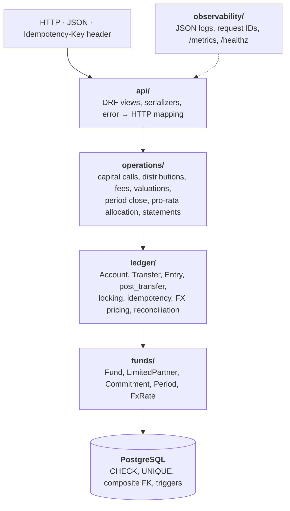

# Fund Ledger

[](https://github.com/IbraCoded/fund-ledger/actions/workflows/ci.yml)

A double-entry ledger for private-equity fund accounting, covering capital calls, distributions,
reversals, FX, fees, valuations, period close and LP capital account statements. PostgreSQL
enforces correctness itself: the database rejects unbalanced, edited or deleted entries,
so the rules hold even if the application code has a bug.

Django 5.2 · Django REST Framework · PostgreSQL 16 · Python 3.12

## What it does

Limited Partners (LPs) commit capital to a fund. The fund calls that capital, invests it,
charges fees, revalues its holdings and distributes proceeds back to the LPs. Every one of
those events is recorded as a **transfer**: a set of entries across accounts that must sum
to exactly zero. The ledger guarantees that:

- no money is lost or double-counted, and no transfer is ever silently edited,
- a balance can be asked for at any point in time ("this LP's balance on 30 June"),
- concurrent requests can't corrupt balances or overdraw an account,
- a retried request can't move money twice.

## Architecture



Imports only point downwards. The `ledger` engine knows nothing about capital calls. Its only
job is to move amounts between accounts atomically, exactly once, without ever letting the
books go out of balance. Business operations are thin clients of that engine: they work out
the amounts, then call `post_transfer`. Keeping the engine small means it can be tested
exhaustively with property-based and real multi-connection concurrency tests.

Each rule is enforced at three levels: serializers reject malformed input with a 400,
services apply business rules with clear errors, and the database has the final say.

### One capital call, end to end

```
RequestIDMiddleware        binds request_id to every log line
└─ CapitalCallsView        requires Idempotency-Key; money parsed as Decimal, never float
   └─ with_deadlock_retry  retries on Postgres 40P01 / 40001
      └─ run_idempotent    SAVEPOINT
         └─ create_capital_call
            ├─ SELECT fund FOR UPDATE                  serialises call numbering
            ├─ allocate()  pro-rata, largest remainder
            └─ post_transfer
               ├─ SELECT accounts FOR UPDATE ORDER BY id   deadlock-free lock order
               ├─ price legs (FX), check balanced, check funds
               ├─ INSERT transfer + entries   ── trigger: is the period OPEN?
               └─ SET CONSTRAINTS IMMEDIATE   ── deferred trigger: do entries sum to 0?
         ├─ success → RELEASE SAVEPOINT → 201
         └─ duplicate key → ROLLBACK TO SAVEPOINT, compare request fingerprint → 200 or 422
```

## Invariants and how they're enforced

| Invariant | Enforced by | Proven by |
|---|---|---|
| Every transfer balances | Deferred constraint trigger, checked at commit | [`test_unbalanced_transfer_is_rejected_at_commit`](tests/ledger/test_db_invariants.py#L38) |
| Entries and transfers are append-only | Database triggers reject UPDATE and DELETE | [`test_entries_cannot_be_updated`](tests/ledger/test_db_invariants.py#L63) |
| An entry's currency is its account's currency | Composite foreign key | [`test_entry_currency_must_match_account`](tests/ledger/test_db_invariants.py#L78) |
| Balances are derived, never stored | No balance column; point-in-time queries over entries | [`test_point_in_time_balance`](tests/ledger/test_post_transfer.py#L107) |
| Money is exact | `NUMERIC(20,4)`; JSON numbers parsed as `Decimal` at the edge | [`test_json_numbers_are_parsed_as_decimal`](tests/api/test_capital_calls_api.py#L46) |
| Money moves exactly once | Unique idempotency key, savepoint, request fingerprint | [`test_concurrent_duplicates_create_exactly_one_transfer`](tests/ledger/test_idempotency.py#L47), [`test_key_reuse_with_different_body_is_422`](tests/api/test_capital_calls_api.py#L38) |
| No overdrafts under concurrency | Row locks taken in primary-key order | [`test_no_account_goes_negative_under_concurrent_load`](tests/ledger/test_concurrency.py#L18) |
| Opposing transfers can't deadlock | Same lock ordering, plus retry as a second line of defence | [`test_opposing_transfers_do_not_deadlock`](tests/ledger/test_concurrency.py#L44) |
| Nothing posts into a closed period | `FOR SHARE` trigger on entry insert; closing is final | [`test_database_rejects_entries_into_closed_period_even_bypassing_python`](tests/operations/test_periods.py#L59), [`test_close_waits_for_in_flight_postings`](tests/operations/test_periods.py#L93) |
| Pro-rata shares sum exactly | Largest-remainder allocation | [`test_shares_sum_exactly_and_stay_within_a_penny`](tests/operations/test_allocation.py#L16) |
| FX history is never rewritten | Rate captured on each entry at posting time | [`test_later_rate_changes_never_rewrite_history`](tests/ledger/test_fx.py#L46) |
| Σ LP capital = NAV | Exact allocation and double entry | [`test_partners_capital_equals_nav`](tests/operations/test_statements.py#L80) |

The suite contains 100+ tests, including Hypothesis property tests and multi-connection
concurrency tests that really commit. CI runs ruff, mypy and pytest with an 85% branch
coverage gate. It then seeds a realistic ledger **twice**, where the second run must replay
rather than duplicate, and runs `reconcile` against it.

## API

All paths are under `/api/v1/`. Money-moving `POST`s require an `Idempotency-Key` header.

| Method | Path | Purpose |
|---|---|---|
| GET | `funds/{fund_id}/accounts/` | Chart of accounts for a fund |
| POST | `funds/{fund_id}/capital-calls/` | Call capital pro-rata to commitments |
| POST | `funds/{fund_id}/distributions/` | Distribute cash pro-rata |
| POST | `transfers/{transfer_id}/reverse/` | Reverse a transfer without touching the original |
| GET | `accounts/{account_id}/balance/?as_of=` | Native and base-currency balance, optionally at a point in time |
| GET | `accounts/{account_id}/entries/` | Entry history for an account |
| GET | `funds/{fund_id}/lps/{lp_id}/statement/?period=` | LP capital account statement, as JSON or CSV |
| GET | `funds/{fund_id}/reconciliation/` | Live check that the fund's books balance |

The API returns duplicate replays as `200` with the original body. It rejects a key reused
with a different body with `422`. Constraint violations caused by concurrent requests map to
clean 4xx responses, and deadlocks or serialization failures are retried.

## Observability

- **Logs:** JSON structured logs. Every line carries a `request_id`, taken from the caller's
  `X-Request-ID` header when it is safe to use, otherwise generated, and echoed in the response.
- **Metrics** at `/metrics` (Prometheus, multi-process safe under gunicorn):
  - `ledger_transfers_total{transfer_type, outcome}`: created, replayed, rejected or error
  - `ledger_transfer_duration_seconds`: posting latency, including lock waits
  - `ledger_db_retries_total{sqlstate}`: deadlock and serialization retries
  - `ledger_reconciliation_imbalance`: the live imbalance, which should always be 0
- **Health** at `/healthz`, which also checks the database.

## Performance

Measured with Locust ([`loadtest/locustfile.py`](loadtest/locustfile.py)) running a mix of
60% balance reads, 30% new capital calls and 10% replays of earlier capital calls. Replays
count as failures unless they return `200`.

**Conditions:** 50 concurrent users, spawn rate 10/s, 2 minutes, 50–200 ms think time.
The app ran on gunicorn with 4 sync workers against PostgreSQL 16, all in Docker (WSL2) on an
AMD Ryzen 9 8940HX laptop (12 logical CPUs, 16 GB RAM). Every capital call targets the
same demo fund.

| Endpoint | Requests | RPS | p50 | p95 | p99 | Failures |
|---|---:|---:|---:|---:|---:|---:|
| balance (read) | 3,999 | 31.7 | 630 ms | 1,700 ms | 2,100 ms | 0 |
| capital_call | 2,048 | 16.2 | 830 ms | 2,100 ms | 2,500 ms | 0 |
| capital_call_replay | 654 | 5.2 | 640 ms | 1,700 ms | 2,200 ms | 0 |
| **All requests** | **6,751** | **53.6** | **680 ms** | **1,800 ms** | **2,300 ms** | **0** |

**After the run:** `manage.py reconcile` reported *Ledger balanced (imbalance 0.0000)*,
`ledger_reconciliation_imbalance` was 0, `ledger_db_retries_total` never incremented (no
deadlocks or serialization failures), and every replay returned the original capital call.

### What the numbers show

This is a closed-loop test with short think times, so it drives the system to saturation.
The latencies above are mostly **queueing time**, not the cost of a single request.

The ceiling is the **hot fund lock**. Every capital call locks the fund row, the fund's cash
account and every LP account, so all capital calls on one fund run one at a time however many
workers are added. About 16 calls per second works out to roughly 60 ms of locked work per call.
Reads take no locks, but with 4 sync workers, any worker waiting on the fund lock can't serve
anyone else. So balance reads queue behind writes at the worker level, even though
PostgreSQL could serve them immediately.

Mitigations I'd reach for, in order:

1. Move per-fund call numbering off the fund row and onto a sequence, so the fund row stops being a lock.
2. Serve reads from a separate worker pool, or use async workers, so reads never queue behind lock waiters.
3. Batch many small capital calls into a single transfer.
4. Split hot accounts into N sub-accounts and sum them when reading.

## Running locally

```bash
cp .env.example .env
docker compose up -d --build                 # Postgres, migrations, then the API on :8000
docker compose exec api python manage.py seed_demo
docker compose exec api python manage.py reconcile
curl -s localhost:8000/healthz
```

The demo seed creates *Glasgow Growth Partners I* (GBP base currency) with its LPs,
commitments, periods and FX rates. It is idempotent, so running it again replays rather
than duplicates.

**Tests** (need a local Postgres):

```bash
docker compose up -d db
uv sync
uv run pytest --cov
```

**Load test:**

```bash
docker compose --profile load run --rm locust \
  -f /mnt/locust/locustfile.py --host http://api:8000 \
  --headless -u 50 -r 10 -t 2m --csv /mnt/locust/results
```

Or run `docker compose --profile load up locust` and open http://localhost:8089.
On Linux, if Locust can't write its results, run `chmod o+w loadtest`.

## Current limitations

- **No authentication or authorization yet.** Every endpoint is open, so don't expose it publicly.
- Capital-call throughput per fund is capped by the fund-level lock (see Performance).
- Pro-rata is by commitment. There is no full distribution waterfall (preferred return, carry).
- Runs as a single Docker Compose stack. There is no production deployment yet.
